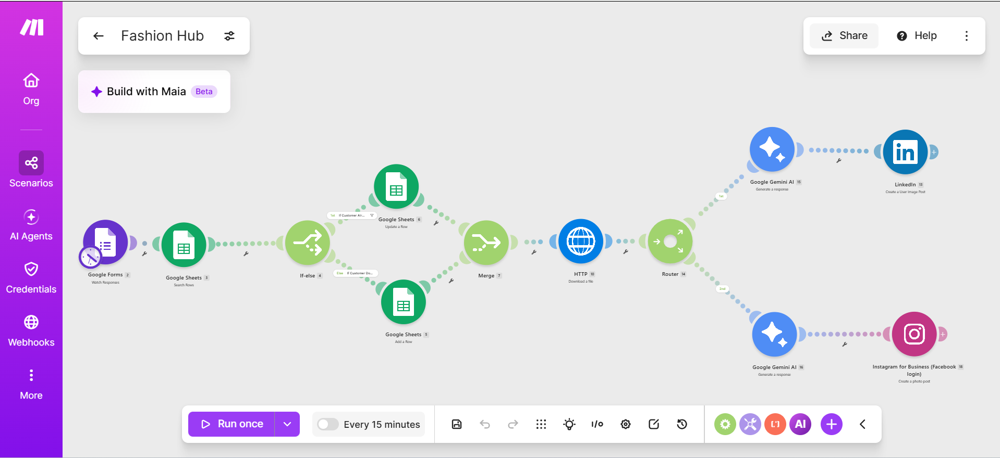
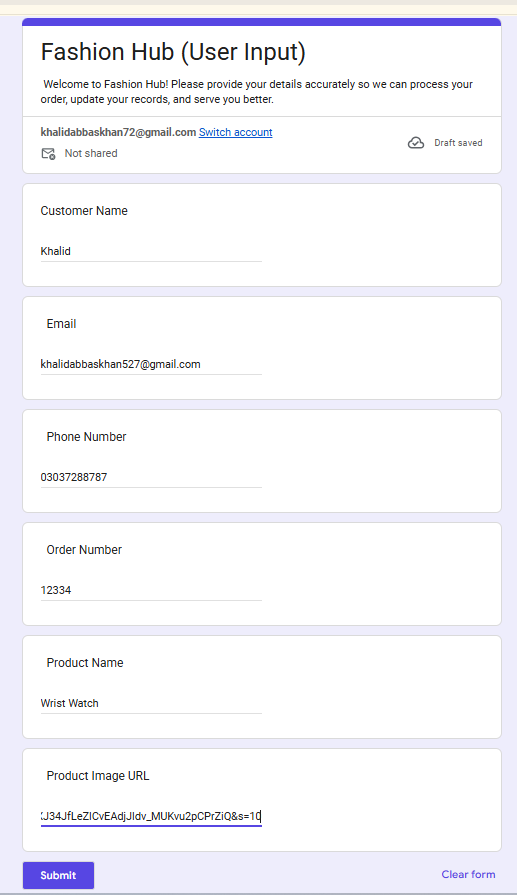
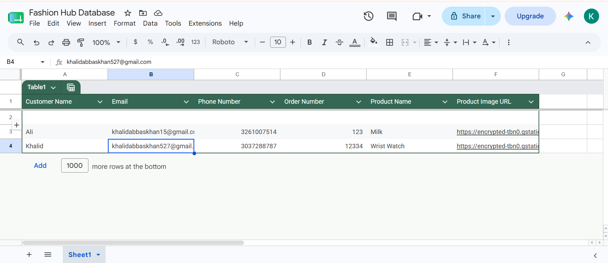
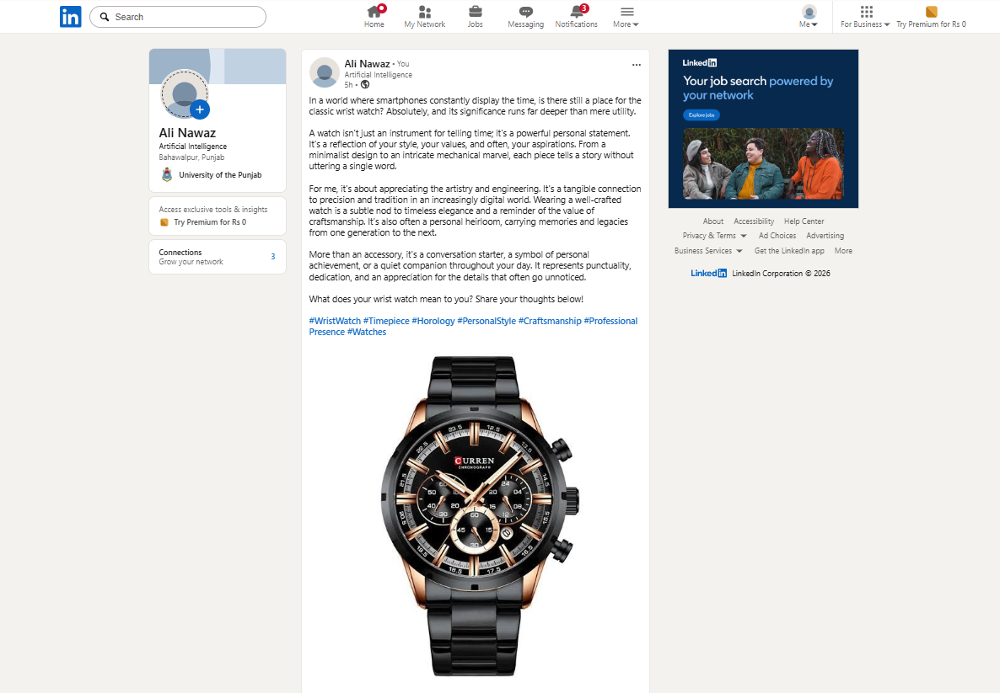
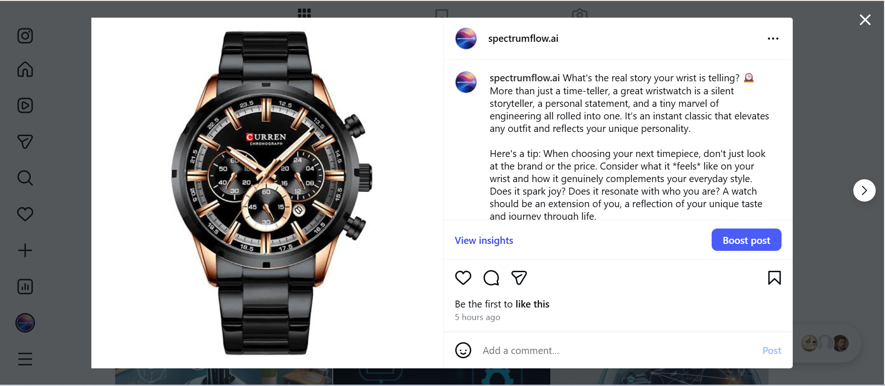
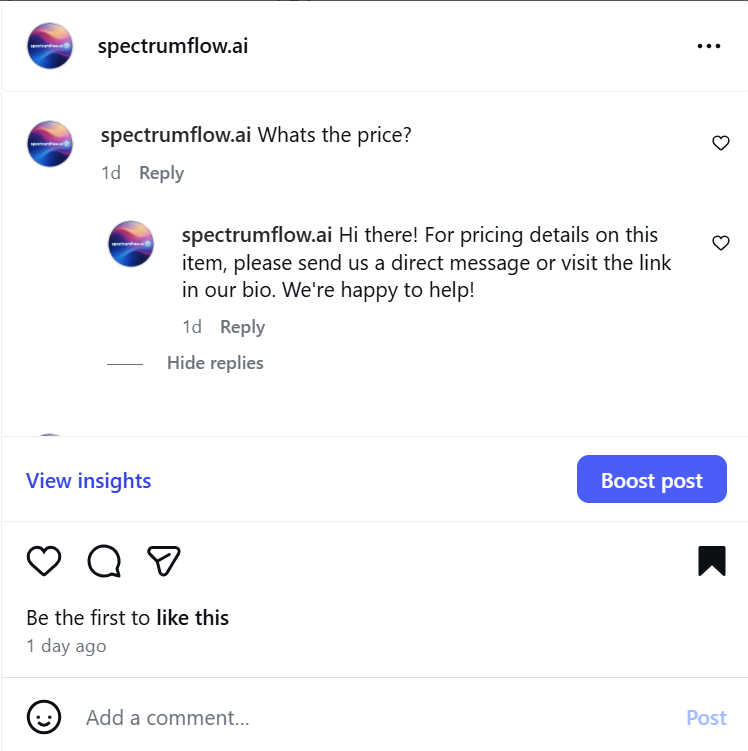

# Fashion Hub — AI-Powered Customer & Social Media Automation (Make.com)

An end-to-end **Make.com** automation built for a clothing brand ("Fashion Hub") that unifies customer intake, CRM record-keeping, AI-generated social media publishing, and automated Instagram comment replies — all in a single scenario, with zero manual intervention.



## 📌 Overview

When a customer places an order, their details are captured through a Google Form. The automation then:

1. Checks whether the customer already exists in the CRM (Google Sheets) by email.
2. Updates the existing record, or creates a new one.
3. Downloads the submitted product image.
4. Uses **Google Gemini AI** to generate a platform-specific caption for LinkedIn and a different one for Instagram.
5. Publishes the product photo automatically to **LinkedIn** and **Instagram for Business**.
6. Automatically replies to common Instagram comments (e.g. "Price?", "Details?", "Available?") with an appropriate business response.

## 🔄 Workflow Breakdown

### 1. Customer Data Collection
A Google Form collects:
- Customer Name
- Email
- Phone Number
- Order Number
- Product Name
- Product Image URL



### 2. Smart Customer Record Management (Deduplication)
- `Google Sheets – Search Rows` looks up the customer by email.
- `If/Else` branches on whether a match was found.
- Existing customers → `Google Sheets – Update a Row`.
- New customers → `Google Sheets – Add a Row`.
- Both branches feed into a `Merge` module so the scenario continues on a single path regardless of which branch fired.



### 3. AI-Generated Social Media Publishing
- `HTTP – Download a file` fetches the product image from the submitted URL.
- `Google Gemini AI – Generate a response` writes a professional caption for LinkedIn.
- `LinkedIn – Create a User Image Post` publishes the product with the generated caption.
- A `Router` splits the flow so Instagram gets its **own** independently generated caption (different tone/format) via a second Gemini call, then `Instagram for Business – Create a photo post` publishes it.




### 4. Instagram Comment Automation
A separate watcher scenario listens for new comments on published posts and matches common customer questions ("Price?", "Details?", "Available?"), replying instantly with a pre-defined business response — no manual moderation needed.



## 🛠️ Tech Stack / Make.com Modules

| Category | Modules Used |
|---|---|
| Trigger | Google Forms (Watch Responses) |
| Data Store | Google Sheets (Search Rows, Update a Row, Add a Row) |
| Logic | If/Else, Router, Merge |
| Media | HTTP (Download a file) |
| AI | Google Gemini AI (Generate a response) |
| Publishing | LinkedIn (Create a User Image Post), Instagram for Business (Create a photo post) |
| Engagement | Instagram comment watcher + keyword-based auto-reply |

## ⚠️ Known Limitations / Lessons Learned

- **Silent no-bundle behavior**: `Google Sheets – Search Rows` can silently return no bundles downstream when no match is found, breaking the flow. Fixed by passing results through an **Array Aggregator** before branching logic.
- **LinkedIn API constraint**: LinkedIn's official Make.com app does not expose an endpoint for reading/replying to comments, so comment automation is only implemented for Instagram.

## 📂 Repository Structure

```
fashion-hub-automation/
├── README.md
├── LICENSE
├── .gitignore
└── screenshots/
    ├── 01-scenario-overview.png
    ├── 02-google-form.png
    ├── 03-google-sheet.png
    ├── 04-linkedin-post.png
    ├── 05-instagram-post.png
    └── 06-instagram-comment-reply.png
```

> **Note:** This repo documents the automation with screenshots and a full breakdown of the logic. If you also have the exported Make.com blueprint (`.json`), drop it in a `/blueprint` folder and link it here so others can import the scenario directly.

## 🚀 Setup (if recreating this scenario)

1. Create a Google Form matching the fields above and connect it to a Google Sheet.
2. In Make.com, build the scenario using the module list above, connecting your own Google, Gemini, LinkedIn, and Instagram for Business (Facebook Login) accounts.
3. Add an **Array Aggregator** after `Search Rows` to avoid the silent no-bundle issue.
4. Set the trigger schedule (e.g. every 15 minutes) or watch responses in real time.
5. Publish a test form submission to confirm the end-to-end flow before going live.

## 🏷️ Tags
`Make.com` `Automation` `AI Automation` `Google Gemini` `LinkedIn Automation` `Instagram Automation` `Google Sheets` `Google Forms` `No-Code` `Workflow Automation`
